<!-- ===================== HERO ===================== -->

<picture>
  <source media="(prefers-color-scheme: dark)" srcset="./assets/layellie-control-center-dark.svg" />
  <source media="(prefers-color-scheme: light)" srcset="./assets/layellie-control-center-light.svg" />
  
</picture>

 

<samp>CONTROL CENTER // NETWORK STATUS</samp>

 
 

 

<!-- ===================== MODULE 01: IDENTITY ===================== -->

 

<table border="0">
<tr>
<td width="62%" valign="top">

> _Full-Stack Developer — turning ideas into fast, polished software, from low-level Windows internals to pixel-perfect React interfaces._

Hi, I'm **Layellie** — a **Full-Stack Developer** and Computer Programming graduate from Türkiye. I genuinely love programming, and I follow that curiosity across the whole stack — building everything from **desktop applications in C# / C++** to **cross-platform mobile apps** and **modern web experiences**, always chasing the next thing to learn.

- 🛠️ &nbsp;**Desktop** — Windows applications and system utilities in **C# / C++**, including **EyeHealth**, **StandbyAndTimer** and **AIO-Hybrid-Clipboard**
- 📱 &nbsp;**Mobile** — building **DailyWell**, a **Flutter (Dart)** app with reminders, gamification and a home-screen widget
- 🌐 &nbsp;**Web** — modern experiences with **React, TypeScript and Tailwind CSS**
- 💡 &nbsp;**Driven by curiosity** — learning new languages and tools by turning them into real projects
- 🎯 &nbsp;Focused on clean code, responsive UX and software people actually keep using

</td>
<td width="38%" valign="middle" align="center">

<samp>VISUAL FEED // ACTIVE</samp>

 
 

</td>
</tr>
</table>

 

<!-- ===================== MODULE 02: RUNTIME ===================== -->
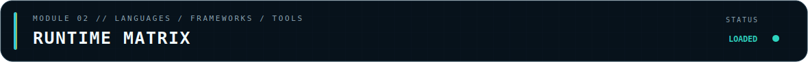

 

<table>
<tr>
<td><samp>01 // LANGUAGES</samp></td>
<td></td>
</tr>
<tr>
<td><samp>02 // FRAMEWORKS</samp></td>
<td></td>
</tr>
<tr>
<td><samp>03 // TOOLCHAIN</samp></td>
<td></td>
</tr>
<tr>
<td><samp>04 // AI WORKFLOW</samp></td>
<td valign="middle">
  
  &nbsp;
</td>
</tr>
</table>

 

<samp>SECONDARY VISUAL FEED // CODE SESSION</samp>

 
 

 

<!-- ===================== MODULE 03: SYSTEMS ===================== -->
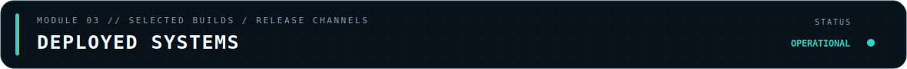

 

<table>
<tr>
<td width="50%" valign="top">

<samp>SYS-01 // MEMORY &amp; TIMER CONTROL // STABLE</samp>

### ⏱️ [StandbyAndTimer](https://github.com/Layellie/StandbyAndTimer)

Advanced **RAM purge** and **0.5 ms system timer-resolution** tool for Windows.

</td>
<td width="50%" valign="top">

<samp>SYS-02 // HYBRID CLIPBOARD // STABLE</samp>

### 📋 [AIO-Hybrid-Clipboard](https://github.com/Layellie/AIO-Hybrid-Clipboard)

Blazing-fast hybrid clipboard manager with built-in **OCR** and reverse image text search.

</td>
</tr>
<tr>
<td width="50%" valign="top">

<samp>SYS-03 // EYE CARE SERVICE // STABLE</samp>

### 👁️ [EyeHealth](https://github.com/Layellie/EyeHealth)

Minimalist native eye-care reminder for Windows with the **20-20-20 rule**, fullscreen-aware breaks and English/Turkish UI.

</td>
<td width="50%" valign="top">

<samp>SYS-04 // WEB INTERFACE // DEPLOYED</samp>

### 🌐 [Portfolio — layellie.github.io](https://github.com/Layellie/Layellie.github.io)

Personal portfolio built with **React, Vite, Tailwind CSS** and **Framer Motion**.

</td>
</tr>
</table>

 

<!-- ===================== MODULE 04: TELEMETRY ===================== -->

 

<picture>
  <source media="(prefers-color-scheme: dark)" srcset="./profile-summary-card-output/github_dark/0-profile-details.svg" />
  <source media="(prefers-color-scheme: light)" srcset="./profile-summary-card-output/github/0-profile-details.svg" />
  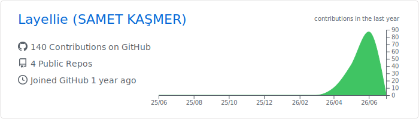
</picture>

 
 

<picture>
  <source media="(prefers-color-scheme: dark)" srcset="./profile-summary-card-output/github_dark/3-stats.svg" />
  <source media="(prefers-color-scheme: light)" srcset="./profile-summary-card-output/github/3-stats.svg" />
  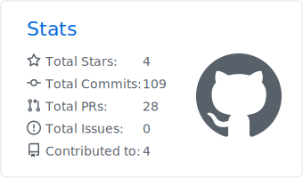
</picture>
&nbsp;
<picture>
  <source media="(prefers-color-scheme: dark)" srcset="./profile-summary-card-output/github_dark/1-repos-per-language.svg" />
  <source media="(prefers-color-scheme: light)" srcset="./profile-summary-card-output/github/1-repos-per-language.svg" />
  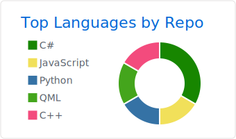
</picture>

 
 

<picture>
  <source media="(prefers-color-scheme: dark)" srcset="https://streak-stats.demolab.com/?user=Layellie&amp;theme=github-dark-blue&amp;hide_border=true&amp;background=07121B&amp;ring=38BDF8&amp;fire=F59E0B&amp;currStreakLabel=2DD4BF" />
  <source media="(prefers-color-scheme: light)" srcset="https://streak-stats.demolab.com/?user=Layellie&amp;theme=default&amp;hide_border=true&amp;background=F7FBFD&amp;ring=0284C7&amp;fire=D97706&amp;currStreakLabel=0D9488" />
  
</picture>

 
 

<picture>
  <source media="(prefers-color-scheme: dark)" srcset="https://github-readme-activity-graph.vercel.app/graph?username=Layellie&amp;bg_color=07121B&amp;color=AFC2CC&amp;line=2DD4BF&amp;point=38BDF8&amp;area_color=0E7490&amp;area=true&amp;hide_border=true&amp;custom_title=CONTROL%20CENTER%20ACTIVITY" />
  <source media="(prefers-color-scheme: light)" srcset="https://github-readme-activity-graph.vercel.app/graph?username=Layellie&amp;bg_color=F7FBFD&amp;color=455B68&amp;line=0D9488&amp;point=0284C7&amp;area_color=67E8F9&amp;area=true&amp;hide_border=true&amp;custom_title=CONTROL%20CENTER%20ACTIVITY" />
  
</picture>

 
 

<samp>EXTENDED METRICS FEED // AUTOMATIC REFRESH</samp>

 
 


 

<!-- ===================== MODULE 05: TERRAIN ===================== -->
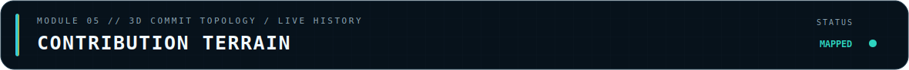

 

<picture>
  <source media="(prefers-color-scheme: dark)" srcset="./profile-3d-contrib/profile-night-rainbow.svg" />
  <source media="(prefers-color-scheme: light)" srcset="./profile-3d-contrib/profile-green-animate.svg" />
  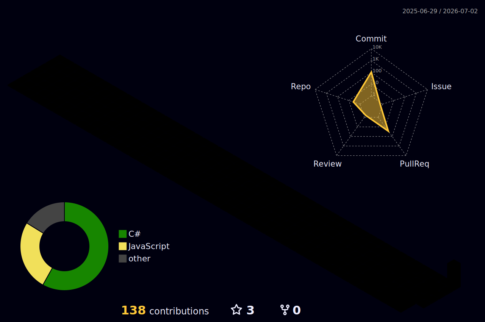
</picture>

 

<!-- ===================== MODULE 06: UPLINKS ===================== -->
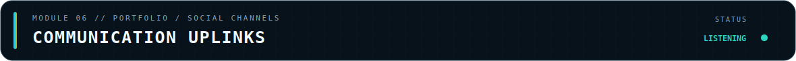

 

<samp>SELECT A COMMUNICATION CHANNEL</samp>

 
 

 

<!-- ===================== CONTROL CENTER FOOTER ===================== -->
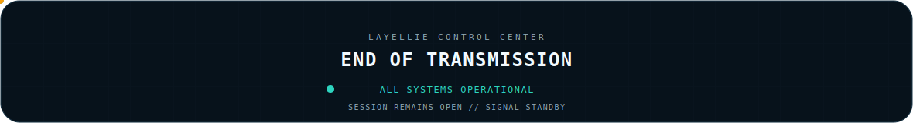
